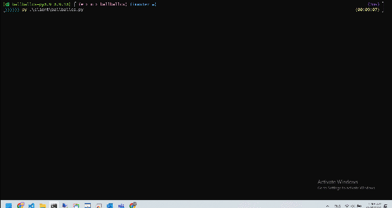
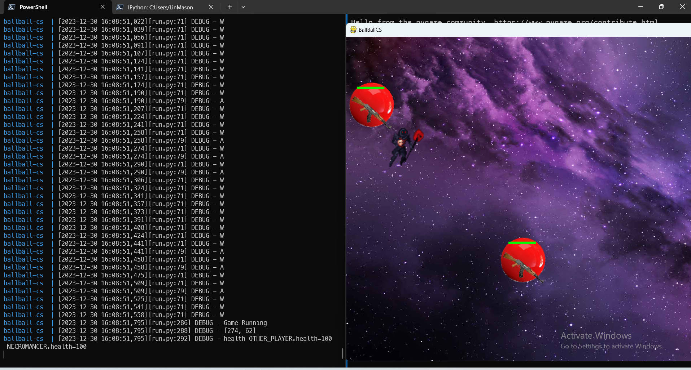
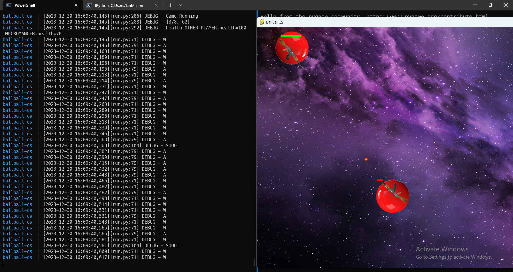

# BallBall CS (a.k.a 球球 CS)

I remember I played a small game in 2008. It is somewhat similar to CS but in top-down perspective.

The character you control is a ball. It is a multiplayer online game and you can shoot each other.

I can't seem to find this game now, and I don't remember the name. Anyway, I'll try to create a similar game.

# Current progress:

> I used pygame to make a small game interface in the client folder. Currently, I am creating an offline game.
> I plan to use the stand-alone version to make the basic structure first, such as collision, life system, item spawn system, two players, etc.
> After completion, change it to a client-server architecture. The server is responsible for calculation, and the client side is only responsible for controlling and receiving the calculation results and presenting them.

Client-Server version is available now.

-   How to run the game:
    1. Run the Server `docker-compose up`
    2. Run the Client `poetry run python .\client\ballballcs.py`

# Game Description

BallBall CS is an exhilarating 2D top-down perspective game inspired by Counter-Strike (CS) but with a unique twist. In this game, players take control of ball characters. The minimalist yet visually engaging design enhances the focus on intense gameplay and tactical decision-making.

# Update history

## 2023/12/30

Able to run the game with client-server architecture

## 2023/12/27

## 2023/12/24

